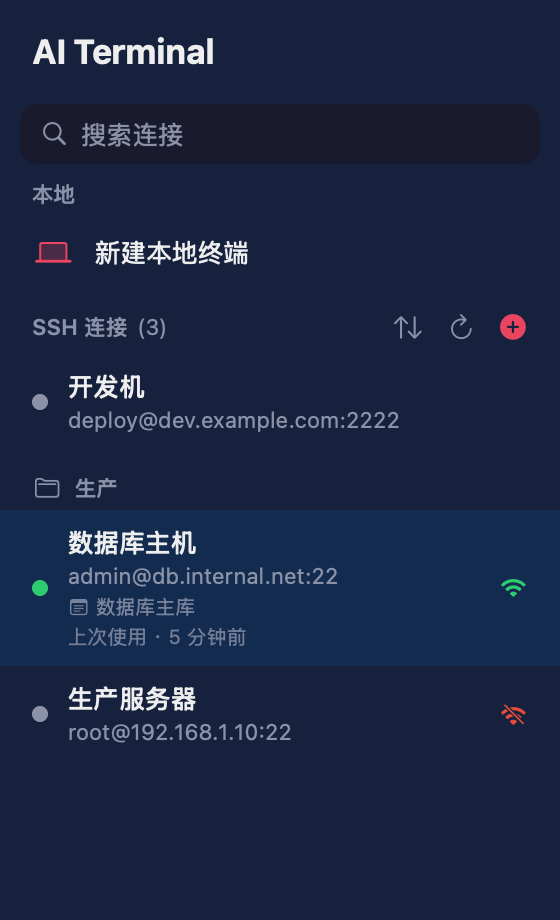
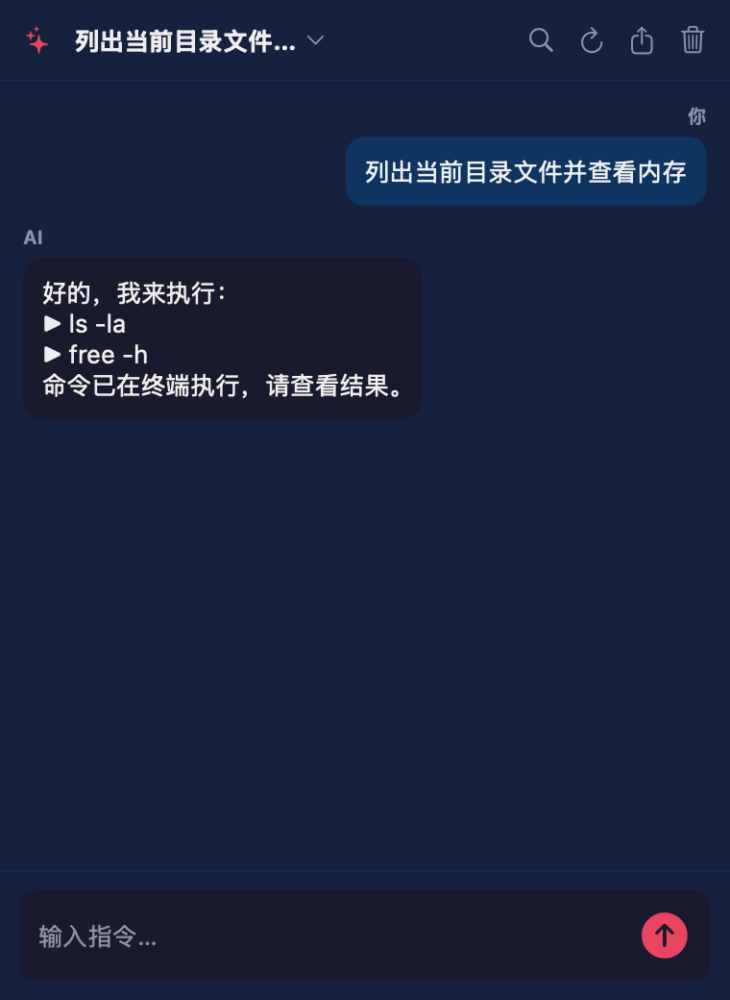
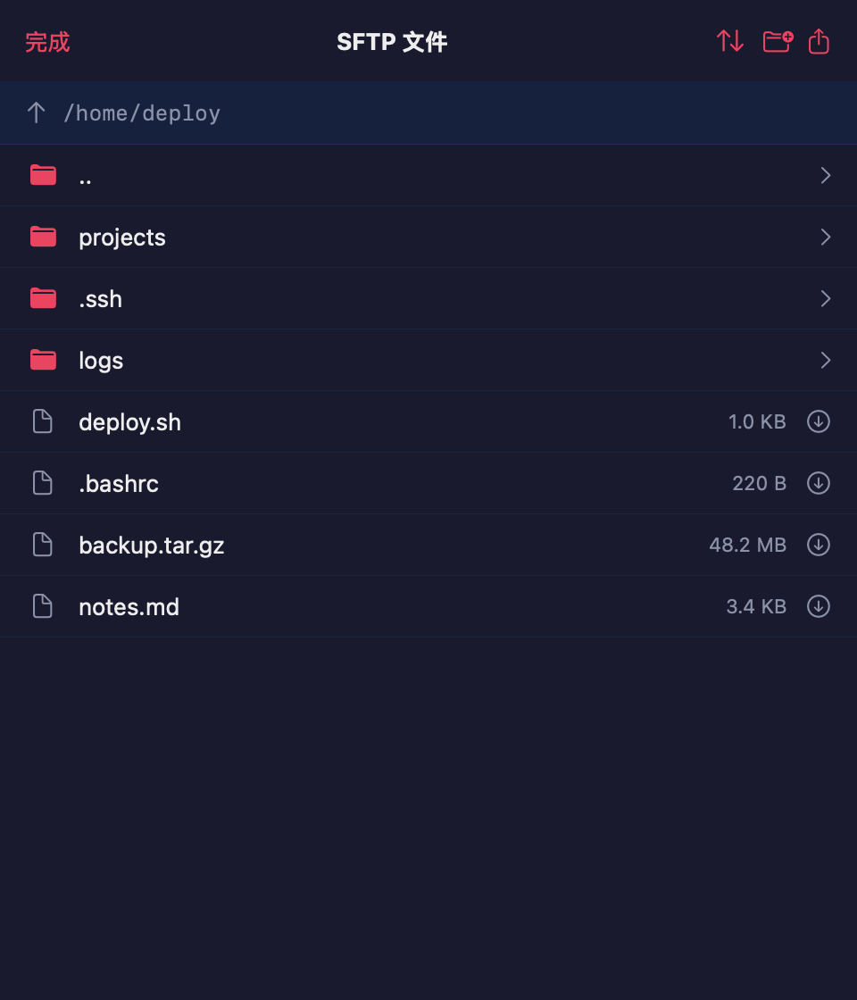
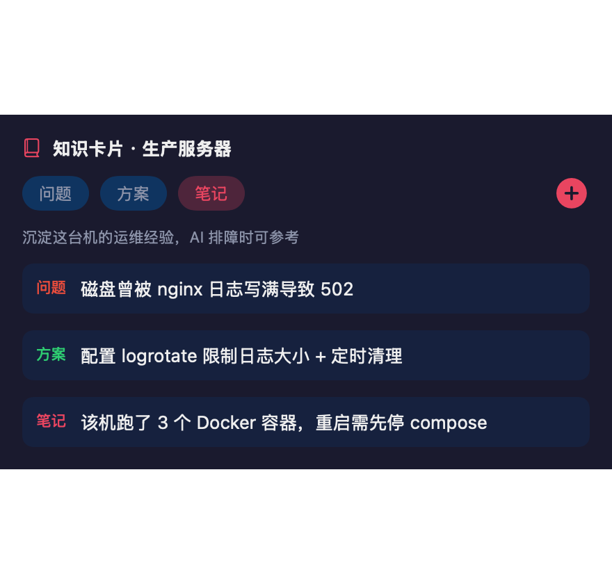
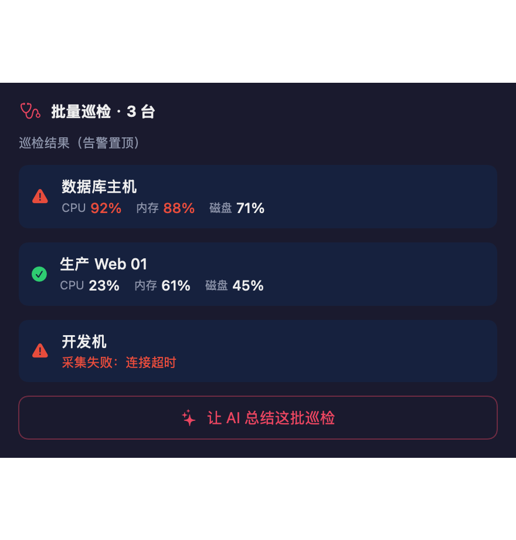
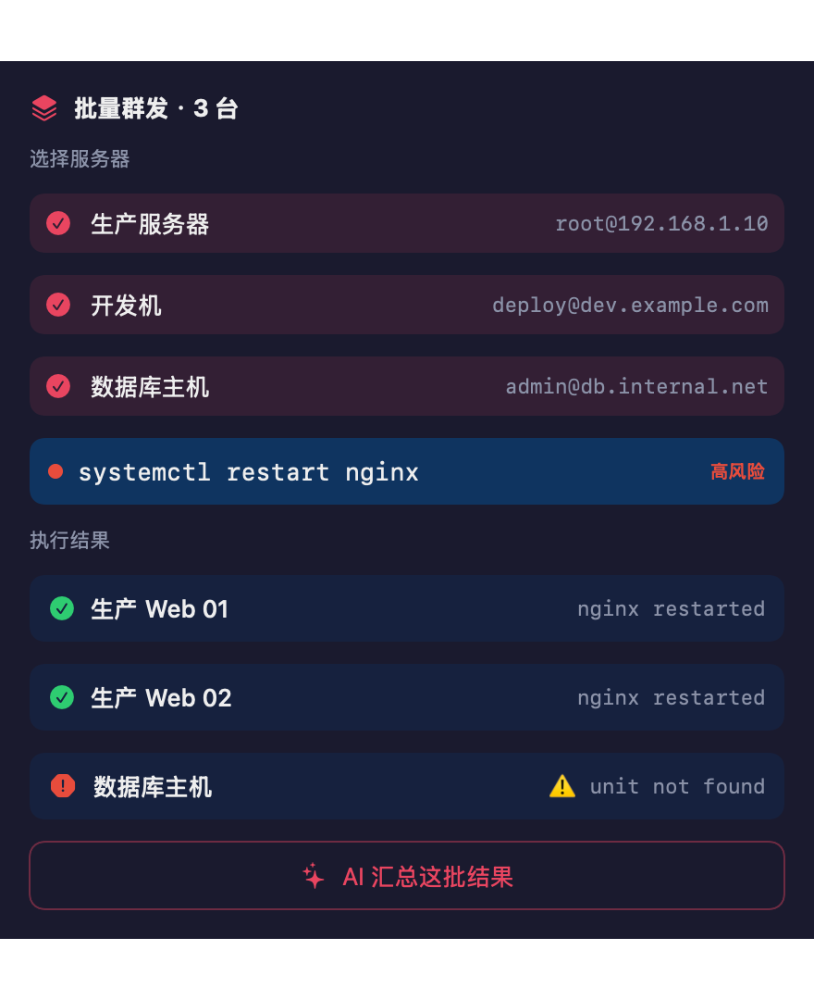

<div align="center">


# Termind

**智能 SSH 服务器运维工作台** —— 不是又一个本地终端，而是以 SSH 为入口、AI 为助手、服务器管理为核心的运维工作台。对标 Xshell / Termius / FinalShell，护城河是 **AI + 真实服务器状态 + 安全执行 + 可回滚**。

[](#平台矩阵)
[](docs/MATURITY.md)
[](docs/MATURITY.md)
[](LICENSE)

</div>

> 📊 **成熟度一览**：双端（apple/android）配对能力 **100 项全对齐** · 护城河 **Z1–Z8**（排障 11 场景 / 部署 11 模板）· 批量运维 · 知识沉淀闭环 · 导入导出对称 · **18 项自测**质量基线。完整能力图谱与边界见 [`docs/MATURITY.md`](docs/MATURITY.md)。

## 定位

传统 SSH 工具只是「连上去敲命令」。Termind 让 AI 真正理解你这台服务器——装了什么、什么系统、当前状态——再给出**针对性、可直接执行、出问题能回滚**的运维建议。围绕一条闭环：

> 理解环境 → 规划 → 评估风险 → 确认 → 执行 → 验证 → 回滚

详见产品构想 [`docs/PRODUCT.md`](docs/PRODUCT.md)。

## 平台矩阵（全平台原生）

按平台用各自最佳原生技术，无 Electron / WebView 中间层。

| 平台 | 原生技术 | 目录 | 状态 |
|------|---------|------|------|
| **macOS / iOS / iPadOS** | Swift + SwiftUI（Citadel SSH + SwiftTerm） | [`apple/`](apple/README.md) | ✅ 旗舰，智能运维 Z1–Z8 全完成 |
| **Android** | Kotlin + Jetpack Compose（sshj + OkHttp） | [`android/`](android/) | ✅ 与 apple 全对齐，可构建 APK |
| **Linux** | Rust + egui/eframe | [`linux/`](linux/) | ✅ cargo build 编译（三栏工作台 UI；真机运行验证留 CI/真 Linux） |
| **Windows** | C# + .NET 9 + Avalonia | [`windows/`](windows/) | ✅ dotnet build 编译 + dotnet run 运行（三栏工作台 UI，Avalonia 跨平台） |

> 早期 Electron / Capacitor Web 方案已按「全平台原生」决策删除，git 历史保留。

## 智能运维能力（双端已落地）

围绕护城河闭环的差异化能力，**apple 与 android 双端均已实现**：

| 能力 | 说明 | apple | android |
|------|------|:---:|:---:|
| 连接管理 | 分组 / 备注 / 持久化 / 增删改 | ✅ | ✅ |
| 真实 SSH | 密码 / 密钥认证，交互式 PTY 终端 | ✅ | ✅ |
| SFTP 文件 | 浏览/查看/下载/上传/新建/重命名/删除/批量删除/排序/过滤 | ✅ | ✅ |
| 服务器状态 | CPU / 内存 / 磁盘实时采集 | ✅ | ✅ |
| **环境感知** | 探测系统/发行版/已装服务 → 喂给 AI | ✅ | ✅ |
| **AI 助手** | 对话 / 命令解释 / 报错分析，流式输出 + 快捷追问/重发/存卡片 | ✅ | ✅ |
| **排障工作流** | 8 场景：网站/磁盘/SSL/Nginx/Docker/内存/端口/服务启动 一键诊断 + AI 总结 | ✅ | ✅ |
| **初始化模板** | 8 模板：Ubuntu Web/Docker/Node/静态站/LNMP/Redis/PostgreSQL/Python 一键部署 | ✅ | ✅ |
| **风险分级** | 命令四级风险（安全/注意/高/极高）+ 高危二次确认 | ✅ | ✅ |
| **敏感脱敏** | 终端输出里的密码/密钥/Token 自动打码 | ✅ | ✅ |
| **操作回滚** | 改关键配置前自动备份 + 时间线 + 一键还原 | ✅ | ✅ |
| SFTP 完整管理 | 浏览/查看/下载/上传/新建/删除/重命名/路径跳转 | ✅ | ✅ |
| 终端体验 | ANSI 彩色 · 控制键栏 · 字号调节 · 复制/清屏 · 输出搜索高亮 | ✅ | ✅ |
| **跳板机 ProxyJump** | 经堡垒机连目标，覆盖全 SSH 操作 | ✅ | ✅ |
| 连接可达性探测 | TCP 探测真实在线状态 | ✅ | ✅ |
| 本地端口转发 | 本机端口经 SSH 转发到远端 | ✅ | ✅ |
| 连接管理增强 | 颜色标签 · 搜索 · 排序 · 启动命令 · 导出导入 · 批量编辑 · 最近使用 | ✅ | ✅ |
| AI 助手增强 | 流式 · 停止 · 重新生成 · 模型选择 · 代码块渲染/复制 · 运维提示词库 · 快捷追问 | ✅ | ✅ |
| 凭据安全存储 | Keychain（apple）/ EncryptedSharedPreferences（android） | ✅ | ✅ |
| TOFU 主机密钥校验 | 首次信任 + 指纹比对防 MITM | ✅ | ✅ |
| 多主题配色 | 午夜 / One Dark / Dracula / Solarized / Nord | ✅ | ✅ |
| AI 多对话 | 新建 / 切换 / 删除 / 持久化 / 搜索 / 导出 Markdown | ✅ | ✅ |
| **服务器知识卡片** | 知识沉淀闭环六环（护城河核心，见下） | ✅ | ✅ |
| 排障工作流（Z4） | 8 场景：网站/磁盘/SSL/Nginx/Docker/内存/端口/服务启动失败 | ✅ | ✅ |
| 初始化模板（Z8） | 8 模板：Ubuntu Web/Docker/Node/静态站/LNMP/Redis/PostgreSQL/Python | ✅ | ✅ |
| 批量运维 | 批量群发 + 群发 AI 汇总 + 批量巡检 + 巡检 AI 总结 + 按分组快速选目标 | ✅ | ✅ |
| 命令收藏夹 | 常用命令星标置顶 · 跨连接快捷复用 | ✅ | ✅ |
| SSH config 导入 | 已有 ~/.ssh/config 批量建连接（apple 读文件 / android 粘贴文本） | ✅ | ✅ |

> 这套能力让 AI 不再只会给通用教程，而是结合**这台机器的真实环境与状态**给出可执行、可回滚的运维方案。
> 完整双端能力对照见 [`docs/PARITY.md`](docs/PARITY.md)——**核心智能运维护城河（Z1–Z8）与 SSH/SFTP/AI/安全主线双端完全对齐**。

### 🚀 批量运维（单连接 SSH 工具做不到）

- **批量群发命令**：选多台服务器，并发执行同一命令、汇总各自输出，高危命令二次确认
- **群发结果 AI 汇总**：一键让 AI 分析这批结果——哪些成功/失败、共性问题、处理建议
- **批量健康巡检**：并发查全部服务器 CPU/内存/磁盘，异常红色置顶 + AI 总结处理优先级
- **命令历史**：执行过的命令去重记录、一键调出重用

> 这是从「逐台 SSH」到「**一批机器的批量操作 + AI 智能洞察**」的运维工作台升级（群发 + 巡检双端完整 UI）。

### 📓 服务器知识卡片（知识沉淀闭环六环 · 护城河差异化核心）

让运维经验沉淀到每台机器上，并让 AI 真正「记得」它。六环全部双端打通：

1. **随手记** — 命令历史一键存为知识卡片
2. **记录** — 每台机沉淀 历史问题 / 解决方案 / 运维笔记（按连接持久化）
3. **筛选检索** — 按 全部/问题/方案/笔记 类型 + 关键词搜索快速定位
4. **喂 AI（全路径）** — 对话/解释/报错/排障/健康 所有 AI 路径都注入这台机的历史 → AI 结合「这台机出过什么、怎么解决的」给**针对性**结论，而非通用教程
5. **AI 结论存为方案** — AI 给出结论后一键沉淀为方案卡片
6. **导出共享** — 导出 Markdown，团队共享运维经验

> 闭环：**随手记 → 记录 → 筛选 → 喂 AI（全路径）→ AI 结论沉淀 → 导出共享**。形成「发现问题 → AI 分析 → 沉淀方案 → 下次复用」的完整运维闭环——这是护城河「AI + 真实环境 + 知识沉淀」的核心落地，单连接 SSH 工具与通用 AI 都做不到。

## 界面预览（apple 端离屏渲染）

> 开发机无完整 Xcode，截图为 SwiftUI `ImageRenderer` 离屏渲染的高保真预览（与真实视图共用 `Theme`）。

| 连接侧边栏 | AI 运维助手 | SFTP 文件 |
|:---:|:---:|:---:|
|  |  |  |

| 服务器知识卡片 | 批量健康巡检 | 批量群发 |
|:---:|:---:|:---:|
|  |  |  |

更多预览见 [`apple/screenshots/`](apple/screenshots/)（状态栏 / 终端控制键 / 快捷命令 / 端口转发 / 多主题 等 20+ 张）。

## 快速开始

### 🍎 Apple 原生（macOS / iOS）

```bash
brew install xcodegen
cd apple/App && xcodegen generate && open AITerminal.xcodeproj
```
选 `AITerminal (macOS)` 或 `AITerminal (iOS)` scheme 运行（需完整 Xcode 16+）。
无 Xcode 时可只校验核心逻辑与自测：

```bash
cd apple/AITerminalCore && swift build       # 平台无关核心
cd apple/App && swift build                  # App 源码（AppCheck 包）
swift run Shots --risk-test                  # 风险分级/脱敏自测（另有 env-detect/diag/rollback/template 等）
```

### 🤖 Android 原生

```bash
cd android
ANDROID_HOME=~/Library/Android/sdk ./gradlew assembleDebug
# 产物：android/app/build/outputs/apk/debug/app-debug.apk
```
需 Android SDK（android-34）+ JDK 17。安装到设备/模拟器后，新建连接（密码或私钥）即可连真实服务器，支持交互式彩色终端、SFTP 文件管理、端口转发、5 套主题；AI 功能需在「设置」配置 Anthropic API Key（加密存储）。

## 项目结构

```
ai-terminal/
├── apple/            # Swift + SwiftUI（macOS + iOS）—— 旗舰
│   ├── AITerminalCore/   # 平台无关核心（SSH/AI/环境感知/风险/回滚/模板）
│   └── App/              # SwiftUI App + xcodegen 工程 + Shots 自测
├── android/          # Kotlin + Jetpack Compose（sshj + OkHttp）
├── relay/            # 可选 WebSocket → SSH 中继（自托管/可信网络）
├── docs/PRODUCT.md   # 产品构想（定位/护城河/MVP）
├── ROADMAP.md        # 路线图 + 阶段进度
└── ITERATION_LOG.md  # 每轮详细迭代日志
```

## 现状与边界（真实说明）

- apple 端：核心逻辑 + UI 均 `swift build` 通过、自测齐全；**出 iOS/macOS 安装包需完整 Xcode**（开发机仅 Command Line Tools，未出包）。
- android 端：`gradle assembleDebug` 通过、产出可安装 APK；**真实连接/AI 对话需真机或模拟器 + 目标服务器 + API Key** 实测。
- Linux 原生端（Rust + egui）：三栏工作台 UI（连接列表 + 终端区 + AI 面板）；`cargo build` 编译通过；真实 ssh2/AI 逻辑对照 apple/android 待接。
- Windows 原生端：架构已定，待在 Windows 环境起步。

## 路线图与历程

- 演进里程碑：[`CHANGELOG.md`](CHANGELOG.md)
- 路线图 + 阶段进度：[`ROADMAP.md`](ROADMAP.md)
- 每轮详细迭代：[`ITERATION_LOG.md`](ITERATION_LOG.md)
- 双端能力对照：[`docs/PARITY.md`](docs/PARITY.md)

## 许可证

MIT，详见 [LICENSE](LICENSE)。
