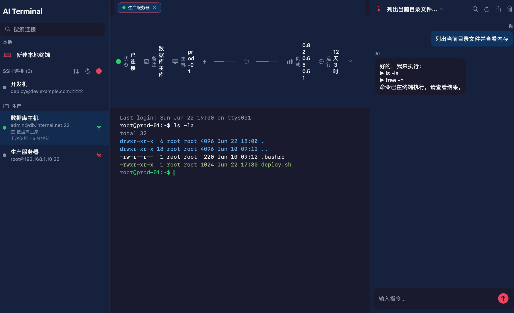
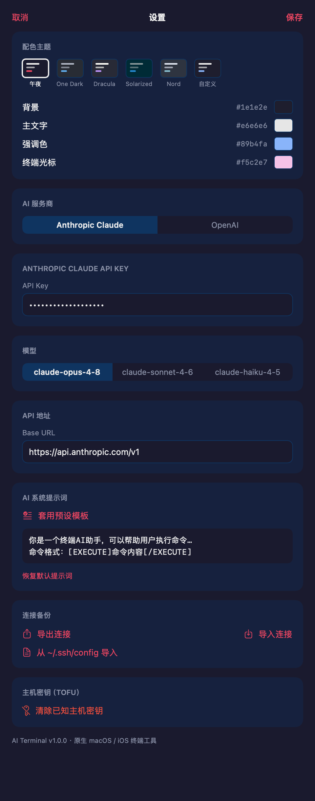
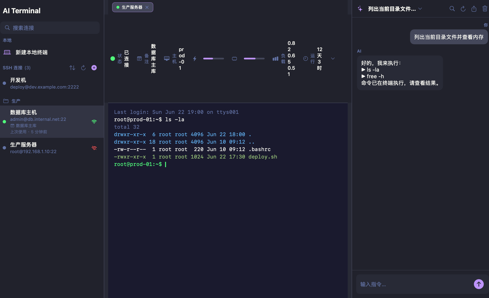
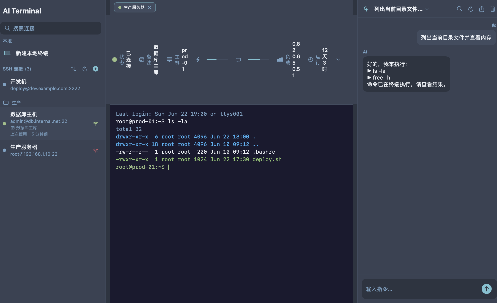

<div align="center">


# AI Terminal

**全平台覆盖的终端 + SSH + AI 工具** —— 本地终端、SSH 远程连接、AI 自然语言执行命令，一套体验贯穿 macOS / iOS / Windows / Linux / Android。

[](#平台矩阵)
[](LICENSE)

</div>

## 平台矩阵

| 平台 | 技术栈 | 目录 | 状态 |
|------|--------|------|------|
| **macOS / iOS / iPadOS** | SwiftUI 原生（SwiftTerm + Citadel） | [`apple/`](apple/README.md) | ✅ 推荐，精品原生体验 |
| **Windows / Linux / macOS** | Electron + React（node-pty + ssh2） | [`src/`](#electron-桌面版) | ✅ 跨桌面 |
| **Android / iOS** | Capacitor 包裹 Web UI | [`mobile/`](mobile/README.md) | 🟡 脚手架 + Web 壳 |
| **移动 / 网页 SSH 中继** | Node（ws + ssh2） | [`relay/`](relay/README.md) | 🟡 WebSocket→SSH 桥接 |

> Apple 平台首选原生版；三大桌面端用 Electron；Android / 纯网页通过 Capacitor + 中继。**全端共享多套配色主题与统一设计语言。**

## 功能对照

各端能力差异（原生 apple/ 最全；Electron 次之；移动最基础）：

| 功能 | 原生 (mac/iOS) | Electron (win/linux/mac) | 移动 (Capacitor) |
|------|:---:|:---:|:---:|
| 本地终端 | ✅ | ✅ | — |
| SSH 连接 / 私钥认证 | ✅ | ✅ | ✅（经中继） |
| 跳板机 / 端口转发 | ✅ | — | — |
| TOFU 主机密钥校验 | ✅ | ✅ | — |
| SFTP 浏览 / 拖拽上传 | ✅ | — | — |
| 连接分组 / 备注 / 克隆 | ✅ | ✅ | — |
| 连接可达性 / 排序 / 连接级字号·启动命令 | ✅ | — | — |
| JSON 导入导出 / ~/.ssh/config | ✅ | ✅（JSON） | — |
| 复制配置到剪贴板 | ✅ | ✅ | — |
| 二维码分享 | ✅ | — | — |
| 配色主题 | ✅（5+自定义+预览） | ✅（5 套） | ✅（5 套） |
| 分屏 / 终端搜索 / 会话录制 | ✅ | — | — |
| 终端右键 复制/粘贴/清屏 | ✅ | ✅（浏览器原生） | — |
| AI 助手（流式/停止/重生成） | ✅ | ✅（基础） | — |
| AI 多对话 / 搜索 / 预设 / 导出 | ✅ | — | — |

> ✅=支持，—=暂无。移动端经 [`relay/`](relay/README.md) 中继提供基础 SSH 终端。功能持续向 Electron/移动对齐中。

## ✨ 功能

- 🖥️ **本地终端**（macOS / 桌面）：完整 shell，实时 CPU / 内存 / 负载监控（状态栏可展开详情）
- 🔐 **SSH 远程**：密码 / ed25519·RSA 私钥认证，**跳板机（bastion）**、**TOFU 主机密钥校验**（known_hosts 管理）、**本地端口转发**、多会话标签，**敏感字段走系统 Keychain**
- 📁 **SFTP 文件浏览**：列目录 / 下载 / 上传，支持**拖拽上传**到当前目录
- 🗂️ **连接管理**：**分组** / **备注** / **可达性探测**（绿/红指示 + 一键刷新）/ **最近使用排序** / **克隆** / 连接级**终端字号** / **启动命令**（连上自动执行）
- 🔁 **跨端互通 / 分享**：通用 JSON 导入 / 导出（含 ~/.ssh/config 导入；[格式](docs/connection-format.md)）、**二维码扫码导入**、复制配置到剪贴板，原生 ↔ Electron ↔ 移动；侧边栏可按 最近使用 / 名称 / 添加顺序排序
- 🤖 **AI 助手**：自然语言生成并执行命令，**流式输出**（可停止 / 重新生成），**多对话**（切换 / 重命名 / 搜索 / 导出当前或全部 Markdown），**自定义系统提示词**（含只读/详解/精简预设），默认 **Anthropic Claude（claude-opus-4-8）**，兼容 OpenAI；高危命令拦截
- 🎨 **主题**：午夜 / One Dark / Dracula / Solarized / Nord + **自定义配色**（UI + 终端一致，预览缩略图，即时切换）
- 🧰 **终端体验**：**可拖拽分屏** · 🔍 搜索（⌘F）· 🔡 字号缩放 · **右键复制/粘贴/全选/清屏** · **会话录制导出** · ↩︎ 会话恢复 · ⚡ 快捷命令片段（可分组搜索）· 📱 iOS 辅助键栏

## 截图（原生版）

| 主界面 | 设置（主题/AI/备份） |
|---|---|
|  |  |

| Dracula 主题 | Nord 主题 |
|---|---|
|  |  |

更多：[`apple/screenshots/`](apple/screenshots/)（侧边栏 / 连接编辑 / SFTP / 分屏 / 搜索 / 快捷命令…）

## 快速开始

### 🍎 Apple 原生版（推荐，macOS / iOS）

```bash
brew install xcodegen
cd apple/App && xcodegen generate && open AITerminal.xcodeproj
```
选 `AITerminal (macOS)` 或 `AITerminal (iOS)` scheme 运行。详见 [`apple/README.md`](apple/README.md)。
> 需完整 Xcode 16+。无 Xcode 时可 `cd apple/AITerminalCore && swift build` 校验核心逻辑。

### 🖥️ Electron 桌面版（Windows / Linux / macOS）

```bash
npm install && npm run rebuild   # 编译原生模块
npm run dev                      # 开发模式
npm run package                  # 打包
```

### 📱 Android / Web（Capacitor）

```bash
cd mobile && npm install
npx cap add android && npx cap sync && npx cap open android
```
详见 [`mobile/README.md`](mobile/README.md)。移动端 SSH 经 [`relay/`](relay/README.md) 中继（自托管）。

## 项目结构

```
ai-terminal/
├── apple/        # SwiftUI 原生（macOS + iOS）—— 推荐
│   ├── AITerminalCore/   # 平台无关核心（SSH/AI/模型/持久化）
│   └── App/              # SwiftUI App + xcodegen 工程
├── src/          # Electron + React（Windows/Linux/macOS）
├── mobile/       # Capacitor（Android/iOS Web 壳）
├── relay/        # WebSocket → SSH 中继（移动/网页用）
├── docs/         # 连接交换格式等
├── ROADMAP.md    # 路线图 + 迭代日志摘要
└── ITERATION_LOG.md  # 每轮详细日志
```

## 路线图

迭代进展见 [`ROADMAP.md`](ROADMAP.md)、[`ITERATION_LOG.md`](ITERATION_LOG.md)。已完成阶段 A（Apple 原生体验，R1–R14）与阶段 B（全端统一，R15–R19）。

## 许可证

MIT，详见 [LICENSE](LICENSE)。
